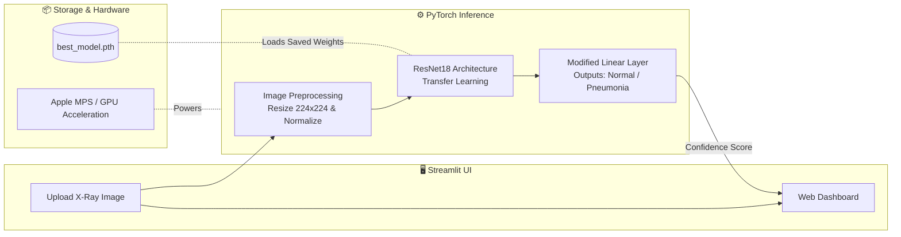

# 🩺 Deep Learning Pneumonia Detector

[INSERT_APP_SCREENSHOT_LINK_HERE]

A full-stack deep learning web application that classifies chest X-rays to detect Pneumonia using Transfer Learning (ResNet18) and a Streamlit frontend. Built with PyTorch and optimized for Apple Metal Performance Shaders (MPS).

## The Dataset
The model was trained on the "Chest X-Ray Images (Pneumonia)" dataset from Kaggle (Paul Mooney), containing 5,863 JPEG images split into Normal and Pneumonia categories.

[INSERT_DATASET_SAMPLES_LINK_HERE]

## Architecture & Pipeline
The core engine relies on a ResNet18 Convolutional Neural Network. We utilized Transfer Learning by freezing the pre-trained core layers and replacing the final fully connected layer to output two classes. 



- **Environment:** Google Colab (T4 GPU)
- **Epochs:** 5
- **Optimizer:** Adam
- **Loss Function:** CrossEntropyLoss

## Installation & Local Execution

To set up and run the Pneumonia Detector locally, follow these steps:

1.  **Clone the repository:**
    ```bash
    git clone https://github.com/your-username/pneumonia-detector.git
    cd pneumonia-detector
    ```

2.  **Install dependencies:**
    ```bash
    pip install -r requirements.txt
    ```

3.  **Run the Streamlit application:**
    ```bash
    streamlit run app.py
    ```

## Usage

Once the Streamlit application is running, you can:

1.  Open your web browser and navigate to the local URL provided by Streamlit (typically `http://localhost:8501`).
2.  Use the file uploader interface to select and upload a chest X-ray image (in JPEG or PNG format).
3.  The application will process the image and display the prediction, indicating whether the X-ray is classified as "Normal" or "Pneumonia."

**Tip**: Test images are provided in the `/sample_images` directory so you can test the app immediately.
